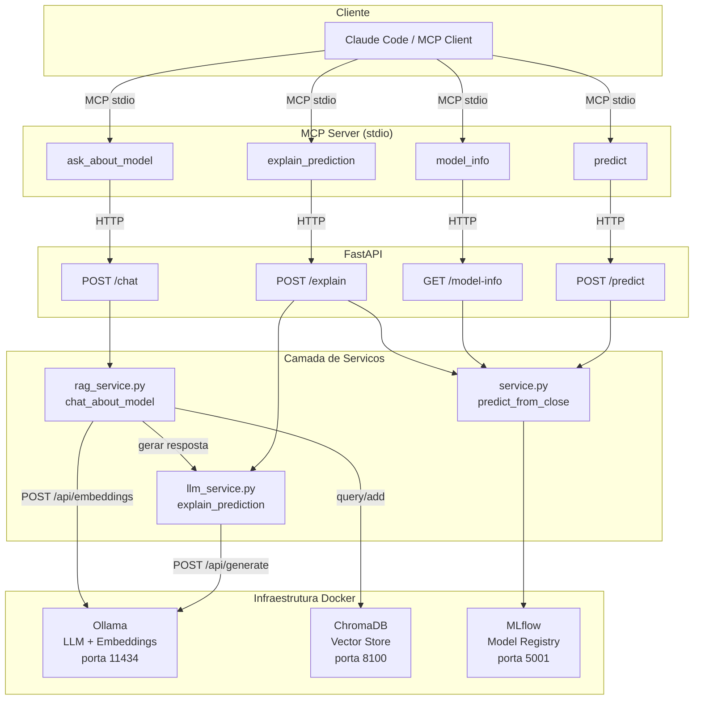
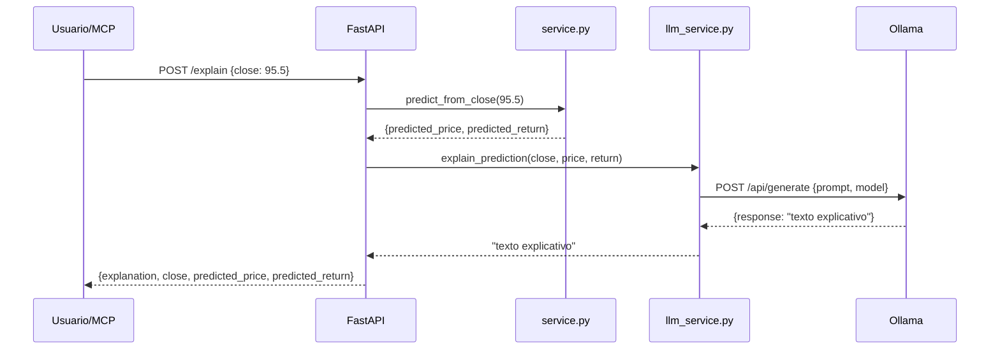
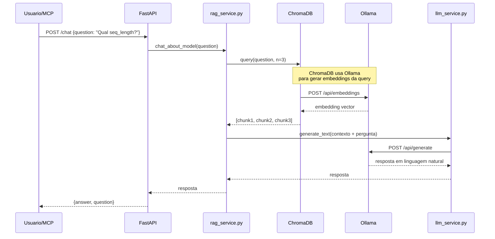
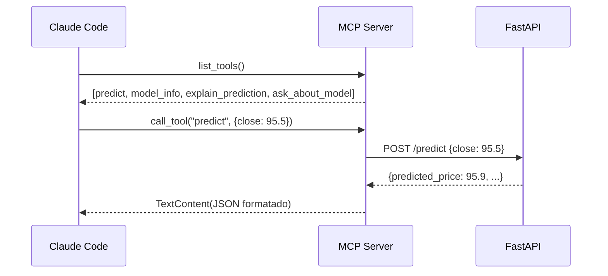

# Arquitetura LLM + RAG + MCP

## Diagrama geral



## Fluxo do endpoint /explain



## Fluxo do endpoint /chat (RAG)



## Fluxo do MCP Server



## Componentes Docker

Todos os serviços abaixo fazem parte do mesmo `docker-compose.yaml`.

| Servico | Imagem | Porta |
|---------|--------|-------|
| Ollama | ollama/ollama:latest | 11434 |
| ChromaDB | chromadb/chroma:latest | 8100 |
| FastAPI | python:3.12-slim | 8000 |
| MLflow | ghcr.io/mlflow/mlflow:latest | 5001 |
| Prometheus | prom/prometheus:latest | 9090 |
| Grafana | grafana/grafana:latest | 3000 |

## Como rodar

```bash
# Sobe a stack inteira (Airflow + FastAPI + MLflow + Prometheus + Grafana + Ollama + ChromaDB)
docker compose up -d

# Aguardar pull dos modelos do Ollama (~5 min na primeira vez)
docker logs -f ollama-pull
```
